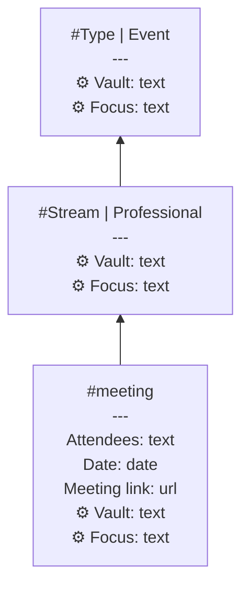
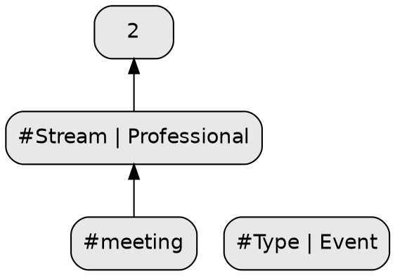

# Supertag Visualization

Generate visual representations of your supertag inheritance hierarchy. See how your tags relate to each other through parent-child relationships.

## Quick Start

```bash
# Generate Mermaid flowchart (default)
supertag tags visualize

# Output to file
supertag tags visualize --output graph.md
```

## Examples

The following examples show the ancestors of the `#meeting` tag using `--from meeting`.

### Interactive HTML Visualization


*2D hierarchical layout with UML-style nodes showing fields and inheritance*

### Interactive 3D Visualization


*3D force-directed graph with labeled nodes and click-to-highlight*

## Output Formats

### Mermaid (Default)

Mermaid flowcharts can be pasted directly into:
- Obsidian notes
- GitHub README/issues/PRs
- Notion
- Many markdown editors

```bash
supertag tags visualize
supertag tags visualize --format mermaid  # explicit
```

Example output (`supertag tags visualize --from meeting --show-fields --show-inherited`):


*Own fields shown normally, inherited fields marked with ⚙️*

### Graphviz DOT

DOT format for rendering with Graphviz to SVG, PNG, or PDF.

```bash
supertag tags visualize --format dot
supertag tags visualize --format dot --colors  # use tag colors
```

Example output:


### JSON

Raw data structure for custom tooling and analysis.

```bash
supertag tags visualize --format json
```

Returns:
```json
{
  "nodes": [
    {"id": "WcNfAKD2JI", "name": "meeting", "fieldCount": 8, "usageCount": 2258, "isOrphan": false, "isLeaf": false},
    {"id": "BpyXUrxqwJ3Q", "name": "Stream | Professional", "fieldCount": 1, "usageCount": 0, "isOrphan": false, "isLeaf": false}
  ],
  "links": [
    {"source": "WcNfAKD2JI", "target": "BpyXUrxqwJ3Q"}
  ],
  "metadata": {
    "totalTags": 8,
    "totalLinks": 7,
    "maxDepth": 4,
    "rootTag": "meeting",
    "generatedAt": "2025-12-24T11:52:38.023Z",
    "workspace": "main"
  }
}
```

### HTML (Interactive 2D)

Self-contained interactive HTML file with UML-style class diagram nodes. Features:
- **Pan & Zoom** - Drag to pan, scroll to zoom
- **Click to Highlight** - Click a node to highlight its inheritance path
- **UML-Style Nodes** - Shows tag name, fields (own and inherited), and usage count
- **Dark/Light Theme** - Choose your preferred color scheme

```bash
# Basic HTML output
supertag tags visualize --format html --output graph.html

# With field details
supertag tags visualize --format html --show-fields --output graph.html

# Include inherited fields
supertag tags visualize --format html --show-fields --show-inherited --output graph.html

# Dark theme
supertag tags visualize --format html --theme dark --output graph.html

# Open in browser after generating
supertag tags visualize --format html --output graph.html --open
```

UML-style node layout:
```
┌─────────────────────┐
│ #meeting            │  ← Header with tag color
├─────────────────────┤
│ Title      : text   │  ← Own fields (normal)
│ Date       : date   │
│ Location   : text   │
├─────────────────────┤
│ Name       : text   │  ← Inherited (italic, gray)
│   (from entity)     │
├─────────────────────┤
│         2,245 uses  │  ← Footer with stats
└─────────────────────┘
```

### 3D (Interactive Three.js)

Interactive 3D visualization using Three.js and 3d-force-graph. Ideal for exploring large, complex tag hierarchies in three-dimensional space. Features:
- **Rotate, Pan & Zoom** - Full 3D camera controls
- **Click to Highlight** - Click a node to highlight ancestors and descendants
- **Force-Directed Layout** - Nodes naturally cluster by relationships
- **Hierarchical Layout** - Optional mode with parents above children
- **Dark/Light Theme** - Choose your preferred color scheme
- **Self-Contained** - Works offline, no external dependencies

```bash
# Basic 3D output
supertag tags visualize --format 3d --output graph.html

# Open in browser immediately
supertag tags visualize --format 3d --output graph.html --open

# Hierarchical layout (parents above children)
supertag tags visualize --format 3d --layout hierarchical --output graph.html

# Dark theme
supertag tags visualize --format 3d --theme dark --output graph.html

# Scale nodes by usage count
supertag tags visualize --format 3d --size-by-usage --output graph.html

# With field details in tooltips
supertag tags visualize --format 3d --show-fields --output graph.html

# All options combined
supertag tags visualize --format 3d \
  --layout hierarchical \
  --theme dark \
  --show-fields \
  --show-inherited \
  --size-by-usage \
  --output graph.html --open
```

**Controls:**
- **Left-drag**: Rotate view
- **Right-drag / Shift+drag**: Pan
- **Scroll wheel**: Zoom
- **Click node**: Highlight inheritance path
- **R key**: Reset view
- **Escape**: Deselect node

## Filtering Options

### Filter by Root Tag (Descendants)

Show only a subtree starting from a specific tag (descendants):

```bash
supertag tags visualize --root source
supertag tags visualize --root "web source"  # quoted if spaces
```

### Filter by Starting Tag (Ancestors)

Show only ancestors of a specific tag (traverse upwards):

```bash
supertag tags visualize --from tweet
supertag tags visualize --from meeting --depth 3  # limit ancestor depth
```

This is useful when you want to see what a tag inherits from, rather than what inherits from it.

### Include Orphans

By default, tags with no inheritance relationships are excluded. Include them with:

```bash
supertag tags visualize --orphans
```

### Limit Depth

Limit how deep the inheritance tree goes:

```bash
supertag tags visualize --root source --depth 2
```

## Display Options

### Graph Direction

Control the flow direction of the graph:

| Direction | Description |
|-----------|-------------|
| `BT` | Bottom to Top (default) - children at bottom, parents at top |
| `TB` | Top to Bottom - parents at top, children below |
| `LR` | Left to Right - parents on left |
| `RL` | Right to Left - parents on right |

```bash
supertag tags visualize --direction TD
supertag tags visualize --format dot --direction LR
```

### Show Field Details

Display field names and types in each tag node (all formats):

```bash
# Show own fields only
supertag tags visualize --show-fields

# Show own and inherited fields
supertag tags visualize --show-fields --show-inherited
```

Example Mermaid output:
```
#meeting
---
Title: text
Date: date
Location: text (entity)  ← inherited, shown with --show-inherited
```

### Use Tag Colors (DOT and HTML)

Apply Tana's tag colors to the graph nodes:

```bash
supertag tags visualize --format dot --colors
supertag tags visualize --format html --colors
```

## Rendering to Images

### Using Mermaid CLI

Install and render Mermaid to PNG:

```bash
# Generate mermaid file
supertag tags visualize --root source > graph.mmd

# Render with mermaid-cli (auto-installs via npx)
npx @mermaid-js/mermaid-cli -i graph.mmd -o graph.png

# Options
npx @mermaid-js/mermaid-cli -i graph.mmd -o graph.png -b white -w 1200
npx @mermaid-js/mermaid-cli -i graph.mmd -o graph.svg  # SVG format
```

### Using Graphviz

Install Graphviz and render DOT files:

```bash
# Install Graphviz
brew install graphviz  # macOS
apt install graphviz   # Ubuntu/Debian

# Generate DOT file
supertag tags visualize --format dot --colors > graph.dot

# Render to various formats
dot -Tpng graph.dot -o graph.png
dot -Tsvg graph.dot -o graph.svg
dot -Tpdf graph.dot -o graph.pdf

# Different layout engines
neato -Tpng graph.dot -o graph.png  # spring model
fdp -Tpng graph.dot -o graph.png    # force-directed
```

### One-liner Examples

```bash
# Mermaid to PNG (one command)
supertag tags visualize --root source | npx @mermaid-js/mermaid-cli -i - -o source.png

# DOT to PNG (one command)
supertag tags visualize --format dot --colors | dot -Tpng -o tags.png

# Full graph to SVG
supertag tags visualize --format dot --show-fields | dot -Tsvg -o full-graph.svg
```

## Use Cases

### Understand Tag Structure

See how your supertags inherit from each other:

```bash
supertag tags visualize --root entity --show-fields --direction TD
```

### Document Your Schema

Generate documentation for your Tana setup:

```bash
supertag tags visualize --format dot --colors --show-fields > schema.dot
dot -Tpdf schema.dot -o "Tana Schema.pdf"
```

### Find Orphan Tags

Identify tags that aren't part of any inheritance hierarchy:

```bash
supertag tags visualize --orphans --format json | jq '.nodes[] | select(.isOrphan) | .name'
```

### Analyze Complexity

Get statistics about your tag hierarchy:

```bash
supertag tags visualize --format json | jq '.metadata'
```

## Troubleshooting

### Graph Too Large

If the full graph is overwhelming:

```bash
# Focus on a specific subtree
supertag tags visualize --root source

# Or use JSON to analyze programmatically
supertag tags visualize --format json | jq '.nodes | length'
```

### Mermaid CLI Not Found

Install via npx (auto-downloads):

```bash
npx @mermaid-js/mermaid-cli -i graph.mmd -o graph.png
```

Or install globally:

```bash
npm install -g @mermaid-js/mermaid-cli
mmdc -i graph.mmd -o graph.png
```

### Graphviz Not Installed

```bash
# macOS
brew install graphviz

# Ubuntu/Debian
sudo apt install graphviz

# Verify
dot -V
```

### Special Characters in Tag Names

Tag names with special characters are automatically escaped in both Mermaid and DOT output. If you encounter issues, use the JSON format and process with custom tooling.

## Command Reference

```
supertag tags visualize [options]

Options:
  --format <format>      Output format: mermaid, dot, json, html, 3d (default: mermaid)
  --root <tag>           Filter to subtree from this tag (descendants)
  --from <tag>           Start tag to show ancestors (upwards)
  --depth <n>            Maximum depth to traverse
  --min-usage <n>        Minimum usage count to include
  --orphans              Include orphan tags (no parents or children)
  --direction <dir>      Graph direction: BT, TB, LR, RL (default: BT)
  --show-fields          Show field names and types in nodes (all formats)
  --show-inherited       Include inherited fields (all formats, requires --show-fields)
  --colors               Use tag colors (DOT and HTML formats)
  --theme <theme>        Color theme: light, dark (HTML and 3D formats, default: light)
  --layout <layout>      3D layout: force, hierarchical (3D format only, default: force)
  --size-by-usage        Scale node size by usage count (3D format only)
  --output <file>        Write to file instead of stdout
  --open                 Open output file after writing (requires --output)
  --json                 Output as JSON (same as --format json)
  -w, --workspace        Workspace alias
```
